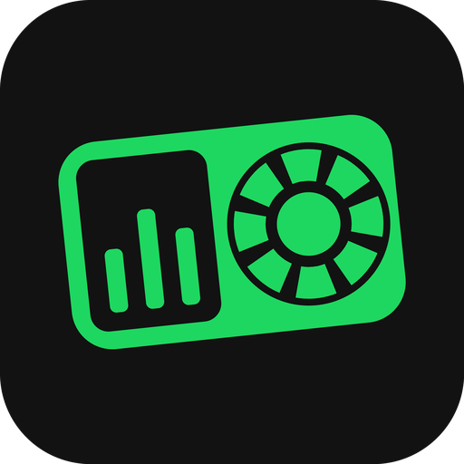

<div align="center">



# Deck Thing

[](#quick-start)
[](https://www.python.org/)
[](firmware/)
[](https://pywebview.flowrl.com/)
[](LICENSE)

**A 4.3" touch display for your desk — what Spotify is playing, your own shortcut keys and a volume mixer for every app, one swipe apart.**

<sub>Work in progress — firmware and app run on the real board; no release yet</sub>

[What you get](#what-you-get) · [Hardware](#hardware) · [Quick start](#quick-start) · [Pages](#pages) · [Spotify extras](#spotify-extras) · [Keys](#keys) · [Audio](#audio) · [Settings](#settings) · [Credits](#credits)

</div>

---

A touch screen next to your keyboard, plugged into your PC with one USB cable.
It shows the song that's playing with its cover, lets you skip, seek, shuffle
and like without leaving your game or your work, gives you a Stream-Deck-style
key pad, and a mixer that turns Discord down without touching your game.

It started as a way to get back what the discontinued Spotify Car Thing did —
on a desk instead of a dashboard, with parts you can simply buy.

## What you get

- **Music** — cover, title, artists, where the music comes from, and a progress bar you can tap to seek
- **All the controls** — play, skip, shuffle and Smart Shuffle, repeat, like
- **Playlists** — your playlists and Liked Songs as cards, one tap to play; tap an artist for their albums
- **Keys** — up to 48 buttons with your own names, icons, emoji or pictures, running shortcuts, programs, scripts or links
- **Free keys** — F13 to F24 exist in Windows but on no keyboard, so they never clash with anything
- **Audio** — a volume mixer for every app that plays sound, with live levels, the real program icons and output device switching
- **Only what you use** — switch off the pages you don't need; a keys-and-audio-only deck is fine
- **Works with both Spotify apps** — the normal download and the Microsoft Store version
- **German and English**, following your Windows language
- **Runs quietly** — lives in the system tray, starts with Windows, updates itself from GitHub

## Hardware

| Part | Needed | Where |
|---|---|---|
| Waveshare ESP32-S3-Touch-LCD-4.3 (800 × 480, capacitive touch) | always | [Waveshare](https://www.waveshare.com/esp32-s3-touch-lcd-4.3.htm) · [Eckstein](https://eckstein-shop.de/WaveShare-ESP32-S3-43inch-Capacitive-Touch-Display-Development-Board-800x480-EN) · Amazon |
| USB-C cable to the PC | always | plug it into the port labelled **USB**, not **UART** |
| M5Stack Encoder Unit (U135) | with knob — *support coming* | [M5Stack](https://shop.m5stack.com/products/encoder-unit) · AliExpress (M5Stack Official Store) |
| M5Stack Grove to Dupont cable (A096) | with knob | [M5Stack](https://shop.m5stack.com/products/grove2dupont-conversion-cable-20cm-5pairs) · AliExpress |
| Case and knob | | printed — see [case/](case/) |

> **Knob wiring:** Grove cables are ordered GND–5V–SDA–SCL, the board's I2C
> socket VCC–GND–SDA–SCL. Never plug one straight into the other — connect wire
> by wire, colour to colour.

<details>
<summary><b>Why not the Adafruit I2C encoder?</b></summary>

The board's CH422G IO expander treats every address from 0x20 to 0x27 and 0x30
to 0x3F as a command, and the Adafruit seesaw encoder sits at 0x36. Moving it to
another address needs its EEPROM, which does not keep the value on current
firmware. The M5Stack unit lives at 0x40, out of the way.

</details>

## Quick start

There is no release yet. Until there is, run both halves from source.

**1. Flash the device** — needs [PlatformIO](https://platformio.org):

```bash
git clone --recurse-submodules https://github.com/juppeee/deck-thing.git
cd deck-thing/firmware/board
pio run -t upload
```

Connect the board through its **USB** port while flashing; the same port later
talks to the app. Details in [firmware/](firmware/).

**2. Start the app:**

```bash
cd deck-thing/companion
pip install -r requirements.txt
python deck_thing.py
```

The device finds the app on its own. No device yet? The Windows simulator shows
the same interface — see [firmware/](firmware/).

<details>
<summary><b>Build the installer</b></summary>

```bash
cd companion
pip install pyinstaller
winget install JRSoftware.InnoSetup
.\build.bat
```

`dist\` then holds `DeckThing-Setup.exe` and the separate updater. The
installer works per user — no admin rights, no UAC prompt. The build stops if
any interface text has no English translation.

> **First launch:** Windows may show a SmartScreen warning ("unknown publisher")
> because the app isn't code-signed. Click **More info → Run anyway**.

</details>

## Pages

Four pages sit along the top of the display. Each one can be switched off under
**Settings → Device** in the app; at least one stays on.

| Page | What it shows |
|---|---|
| **Music** | What's playing, with all controls and the volume slider |
| **Playlists** | Your playlists and Liked Songs; tap one to play it |
| **Keys** | Your shortcut keys — pages to the right or rows below |
| **Audio** | The volume mixer |

## Spotify extras

Title, cover, play, skip, seek, shuffle and repeat work without signing in —
the app reads them from Windows' media controls.

Liking songs, playlists, Smart Shuffle and Spotify's own volume slider need the
Spotify Web API. Since February 2026 that means **Spotify Premium** and a free
developer app of your own, which takes two minutes; **Spotify** in the app walks
you through it. No client secret is involved, and your login stays on your PC.

## Keys

Open **Keys** in the app. Click a slot to edit it, drag slots to swap them, and
**Save** sends the layout straight to the device.

| Action | What it does |
|---|---|
| Free key (F13–F24) | Presses a key no keyboard has — assign it in OBS, Discord or any app with shortcuts |
| Key combination | Record any shortcut, e.g. `ctrl+shift+m` |
| Start program | An `.exe` with optional arguments |
| Run script | `.ps1`, `.bat`, `.cmd` or `.py` |
| Open link | Any URL |
| Media | Play/pause, next, previous, volume |

Eight keys fit on the screen. Need more? Choose whether further keys continue
on **pages to the right** or in **rows below**. Icons come from Lucide, or use
an emoji or your own picture — as an icon, rounded, round, or filling the whole
key — and any colour.

## Audio

The same sessions the Windows volume mixer shows: master volume, microphone,
and every app with sound. Each gets a fader, a mute button and a live level
meter; apps that played something in the last 20 seconds move to the front.
Tap the output device to switch between speakers, headset and monitor.

Two layouts, chosen under **Settings → Device**:

- **Mixer** — vertical faders side by side, swipe for more apps
- **List** — one row per app with a horizontal slider, scroll down for more

The mixer only runs while the page is open, so it costs nothing the rest of the time.

## Settings

| Setting | Default | What it does |
|---|---|---|
| Interface language | Automatic | German on German Windows, English everywhere else |
| Start with Windows | On | Starts hidden in the system tray (`HKCU\…\Run`) |
| Keep running when closed | On | The X button hides the window; the device stays connected |
| Pages on the device | All on | Which pages appear at the top of the display |
| Audio page layout | Mixer | Mixer or list |

<details>
<summary><b>Where your data lives</b></summary>

| Path | Contents |
|---|---|
| `~/.deck-thing/keys.json` | Your key layout |
| `~/.deck-thing/icons/` | Pictures you added to keys |
| `~/.deck-thing/spotify.json` | Your Spotify login (tokens and client ID) |
| `~/.deck-thing/settings.json` | App settings |
| `~/.deck-thing/deck_thing.log` | Log file |

Uninstalling leaves this folder alone.

</details>

<details>
<summary><b>How it fits together</b></summary>

The companion app (`companion/`) reads playback from Windows' media session
and, when signed in, from the Spotify Web API; volumes and levels come from
Windows Core Audio. It renders everything the device needs — covers, emoji,
pictures, program icons — and sends it over a small frame protocol
([docs/protocol.md](docs/protocol.md)) through USB. The device only displays and
reports touches; it never talks to Spotify itself.

</details>

<details>
<summary><b>Under the hood</b></summary>

- **Display:** LVGL draws straight into the RGB panel's two frame buffers and
  swaps them once a frame is complete, so swiping never tears. JPEG covers are
  decoded once when they arrive, not on every redraw.
- **Cores:** panel and interface run on core 1, USB on core 0 — sharing a core
  tripped the interrupt watchdog.
- **Translations:** the German sentence is the key (`companion/i18n.py`,
  `companion/web/i18n.js`); `tools/collect_i18n.py` finds text without a
  translation and runs first in every build.
- **Logo:** `companion/assets/deck_thing.svg` is the only source;
  `tools/make_logo.py` turns it into the app icon, the README logo and the
  parts of the device's start animation.

</details>

<details>
<summary><b>Publishing a release</b> (maintainer)</summary>

1. Raise `VERSION` in `companion/deck_thing.py` and `MyAppVersion` in `companion/setup.iss`
2. Run `build.bat` and attach `DeckThing-Setup.exe` and the firmware to a GitHub release
3. Download the installer from `releases/latest/download/…` and put its SHA-256 into `version.json`
4. Push `version.json` — only after the release exists, or the checksum check fails

</details>

## Updating and uninstalling

The app checks GitHub for updates by itself and offers to install them. No
internet, no problem — the check is skipped silently.

To remove it: **Settings → Apps → Deck Thing → Uninstall**. Your keys, pictures
and login under `~/.deck-thing` survive; delete the folder by hand if you want
those gone too.

## Credits

- **[DeskThing](https://github.com/ItsRiprod/DeskThing)** by ItsRiprod keeps the original Car Thing hardware useful and was the inspiration for this project. None of its code is used here.
- **[LVGL](https://lvgl.io)** (MIT) draws the device interface.
- **Waveshare's [ESP32-S3-Touch-LCD-4.3C examples](https://github.com/waveshareteam/ESP32-S3-Touch-LCD-4.3C)** and Espressif's **[esp_lvgl_port](https://github.com/espressif/esp-bsp/tree/master/components/esp_lvgl_port)** showed how to drive the RGB panel without tearing — waiting for the finished frame rather than VSYNC, and 64-byte cache lines.
- **[EarTrumpet](https://github.com/File-New-Project/EarTrumpet)** and **[SoundSwitch](https://github.com/Belphemur/SoundSwitch)** use the same Windows interface (IPolicyConfig) for switching the output device; none of their code is used here.
- **[Lucide](https://lucide.dev)** (ISC) and **[Material Icons](https://fonts.google.com/icons)** (Apache 2.0) provide the icons; **[Figtree](https://github.com/erikdkennedy/figtree)** by Erik Kennedy (OFL) is the typeface.
- **[cJSON](https://github.com/DaveGamble/cJSON)** (MIT) parses JSON on the device.
- The companion app is built on **[pywebview](https://pywebview.flowrl.com)**, **[aiohttp](https://docs.aiohttp.org)**, **[Pillow](https://python-pillow.org)**, **[pycaw](https://github.com/AndreMiras/pycaw)**, **[pystray](https://github.com/moses-palmer/pystray)**, **[pyserial](https://github.com/pyserial/pyserial)** and **[PyWinRT](https://github.com/pywinrt/pywinrt)**.

## License

The code in this repository is MIT — see [LICENSE](LICENSE). Fonts and icons
keep their own licences, included next to them.

Spotify is a trademark of Spotify AB. This project is not affiliated with,
endorsed by or connected to Spotify.
